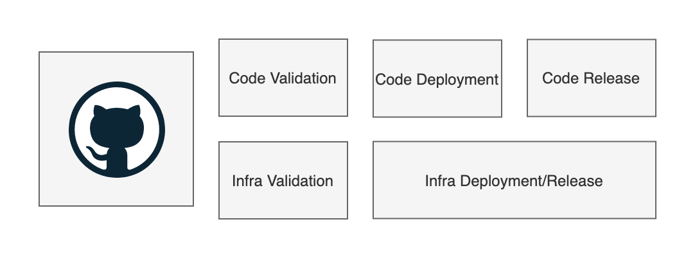
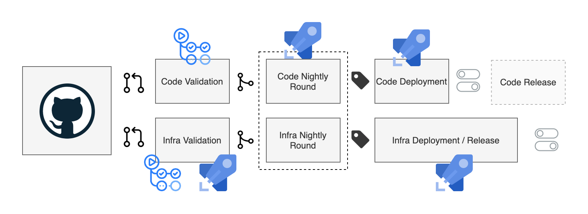

# Proposal 1: CICD

## Context
For Amped it is essential to have a properly developed CICD system working along the code. This is essential for all projects, but especially in an Open Source and contributor driven environment.

The target of such an implementation are more or less captured below:

The specific implementation for this project depends on a lot of variables which are not known at the moment. For instance, how and where the application will be run, what language the default implementation is written in and how thriving the community will be in a few months.

## Requirements
- Every contribution gets feedback as soon as possible
- Code deployments are mostly independent of Infra deployments
- Code Deployment can be separated from Feature Release
- Risk of exposure of credentials or other significant security risks are minimized
- The CICD should explain itself, i.e. by being visible and defined in source

## Proposed Implementation

- Code checks/validation with GitHub Actions for the code on Pull Request update
- Infra validation with GitHub Actions on Pull Request update for basic validation, build and destroy check in a separate environment in Azure Pipelines
- Nightly round for both combined will be limited in first instance, first implementation probably in Azure Pipelines
- Code deployment and release (probably 2-in-1 as a first implementation) in Azure Pipelines
- Infra deployment/release in Azure Pipelines

