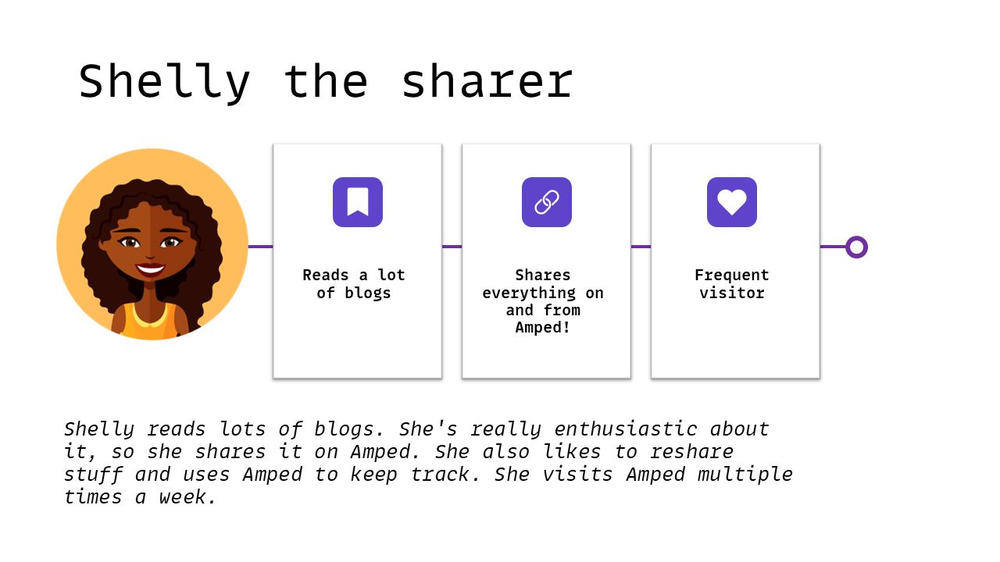
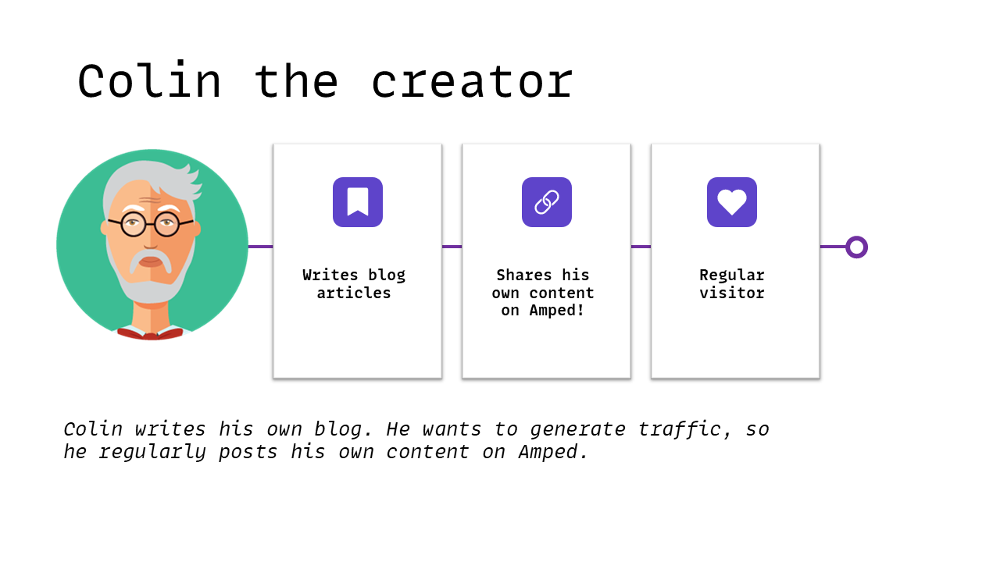
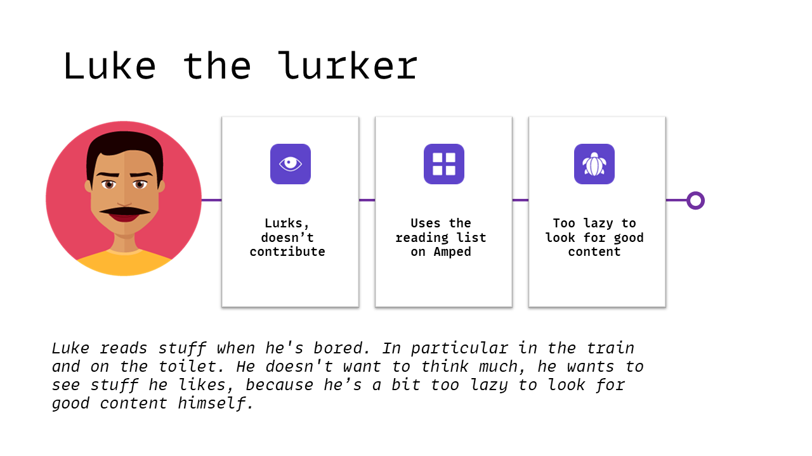
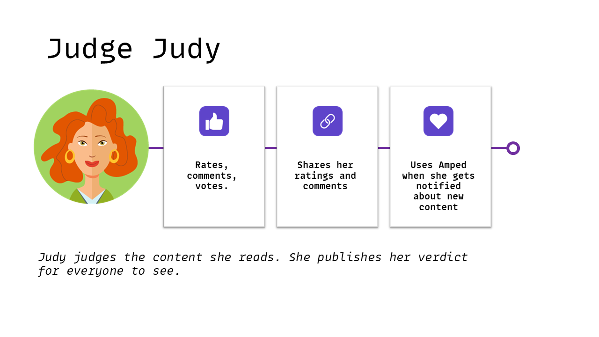
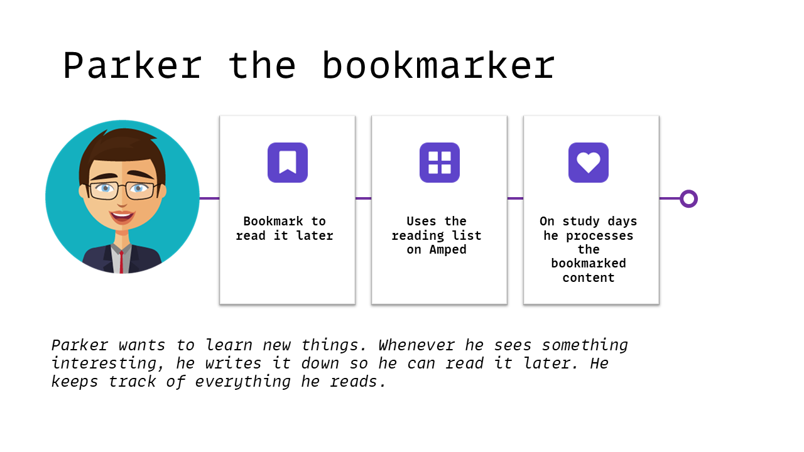

# The Power of Personas

We need ways to understand our stakeholders, our users, target audiency, etc. We need it to design relevant features for them, but in order to be able to identify those features we create general views and simplifications. The problem with this is, that some of those views are biased and can cause problems. We have seen this recently in the news with the automatic software imaging alghorithms (Twitter, Instagram) where pictures containing colored people were wrongly tagged and cropped.

Personas help you understand those stakeholders and users and can help avoid creating problematic biased solutions. We think of them as realistic examples of our audience and use them throughout the entire application lifecycle. This means that personas don't have to be complete at the start of a project: they evolve, just like the software does!

When we started thinking about Amped, we created the following 5 personas.

